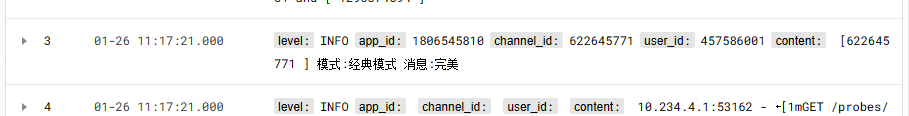

# 腾讯云日志服务CLS接入

**该插件需要兔兔版本至少6.4.5**
不满足条件的情况下安装该插件会导致兔兔无法启动，必须手动删除该插件。

如下图所示，最终日志会通过level,app_id,channel_id,user_id,content几个字段上传到[腾讯云日志服务CLS](https://cloud.tencent.com/document/product/614/11254)中。

提供代码以接入腾讯的CLS服务，你需要在插件配置中填写自己的Key等内容。